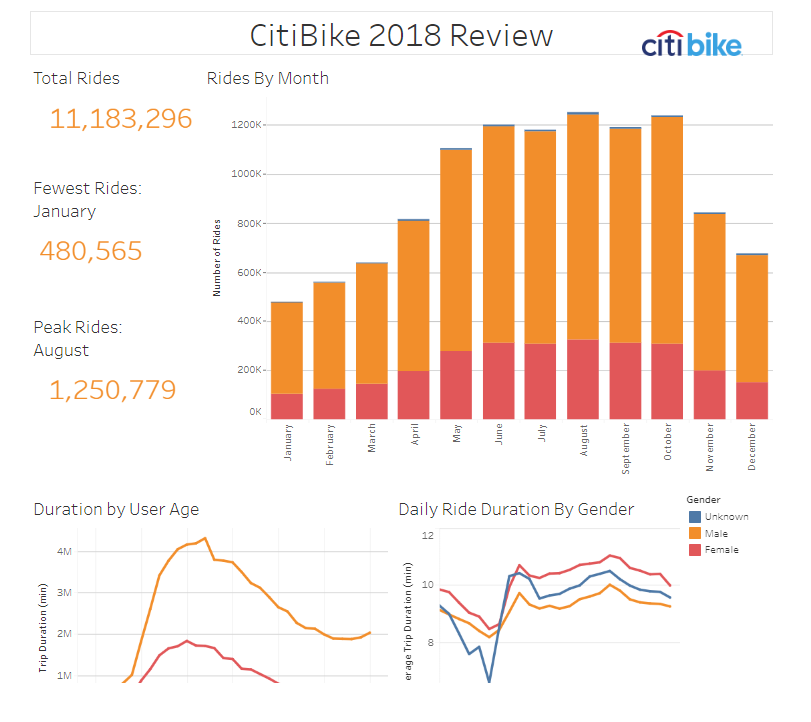
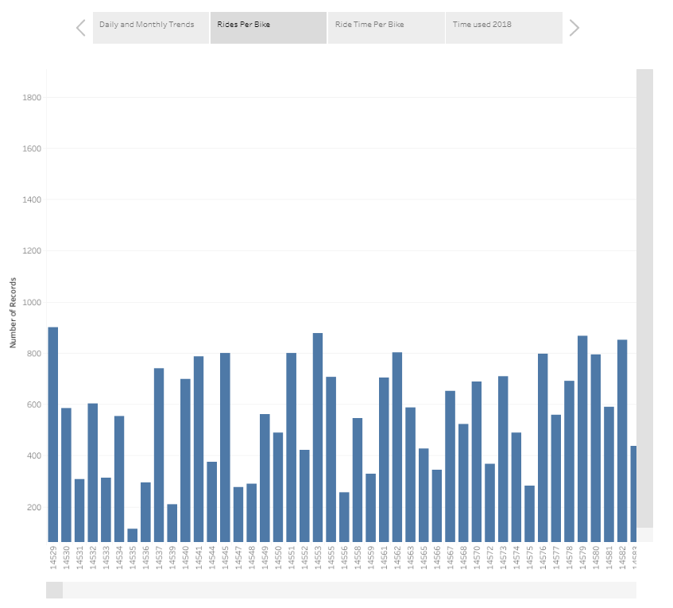
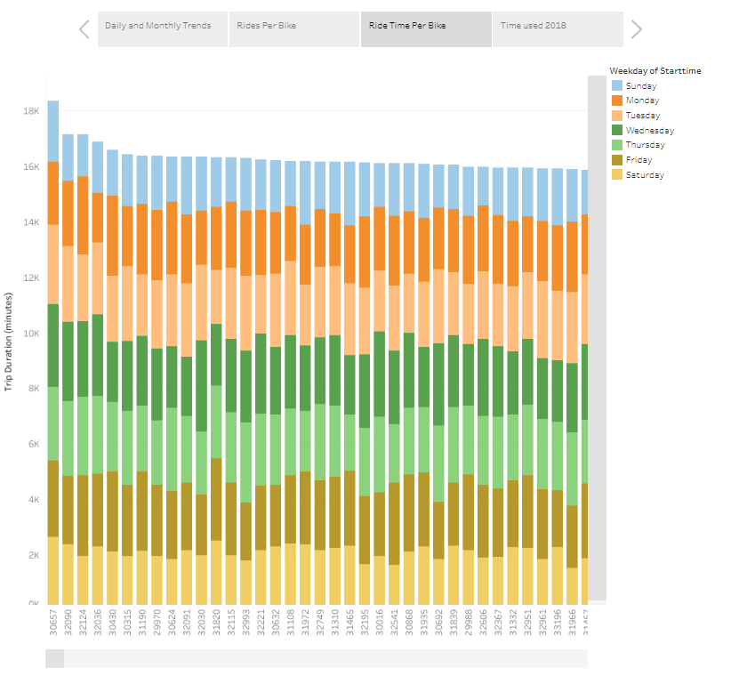
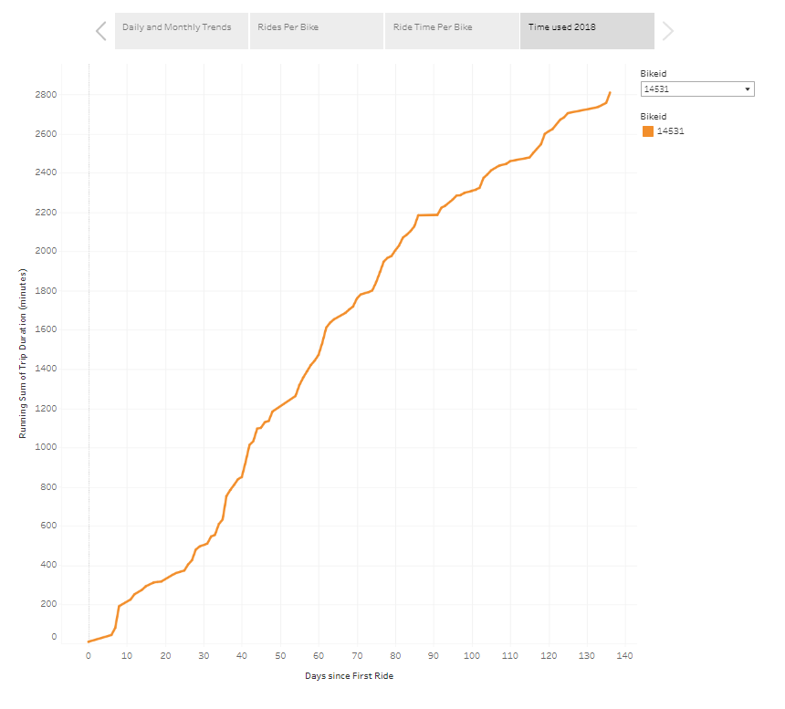
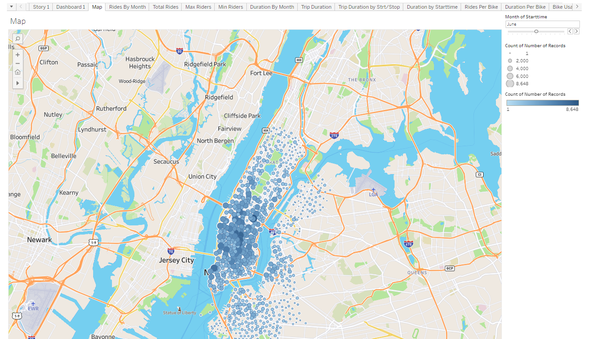
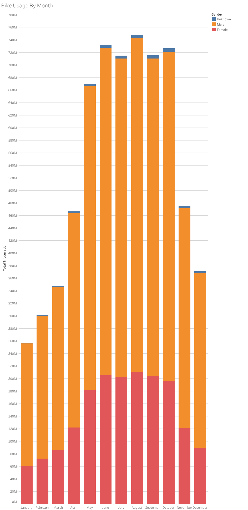
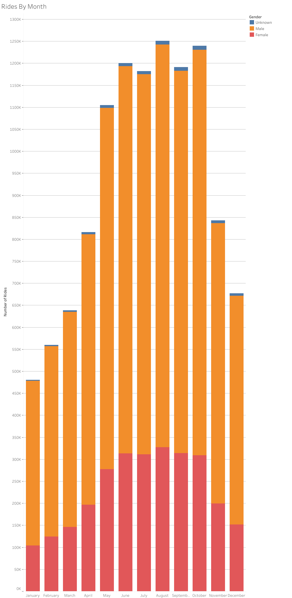

# tableau-citibike

Author:  Erin James Wills, ejw.data@gmail.com  

  
<cite>Photo by [Robinson Greig](https://unsplash.com/@robinson?utm_source=unsplash&utm_medium=referral&utm_content=creditCopyText) on [Unsplash](https://unsplash.com/s/photos/citibike?utm_source=unsplash&utm_medium=referral&utm_content=creditCopyText)</cite>

 

## Overview  

  
Content used for a Tableau dashboard that explains how men and women differ in their NYC Citibike usage 

 

## Technologies    
*  Tableau

 

## Data Source  
Citibike provides data at this S3 bucket:  https://s3.amazonaws.com/tripdata/index.html   

A zipped version of the file is also provided.

 

## Setup and Installation  
1. Environment needs the following:  
    *  Python 3.6+   
    *  pandas
1. Clone the repo to your local machine
1. Navigate the terminal to the repo folder
1. Activate your environment

 

## Examples  

  

 

  

