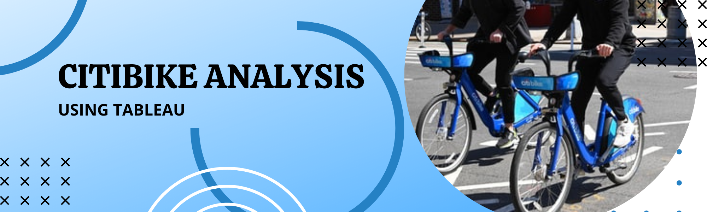

# tableau-citibike

Author:  Erin James Wills, ejw.data@gmail.com  

  
<cite>Photo by [Robinson Greig](https://unsplash.com/@robinson?utm_source=unsplash&utm_medium=referral&utm_content=creditCopyText) on [Unsplash](https://unsplash.com/s/photos/citibike?utm_source=unsplash&utm_medium=referral&utm_content=creditCopyText)</cite>

 

## Overview  

  
Content used for a Tableau dashboard that explains how men and women differ in their NYC Citibike usage 

 

## Technologies    
*  Tableau

 

## Data Source  
Citibike provides data at this S3 bucket:  https://s3.amazonaws.com/tripdata/index.html 

 

## Setup and Installation  
1. Environment needs the following:  
    *  Python 3.6+   
    *  pandas
1. Clone the repo to your local machine
1. Navigate the terminal to the repo folder
1. Activate your environment

 

## Examples  

<!--   

 

  

 -->

<noscript></noscript><object class='tableauViz'  style='display:none;'><param name='host_url' value='https%3A%2F%2Fpublic.tableau.com%2F' /> <param name='embed_code_version' value='3' /> <param name='site_root' value='' /><param name='name' value='CitiBike_15799333292950&#47;Story1' /><param name='tabs' value='yes' /><param name='toolbar' value='yes' /><param name='static_image' value='https:&#47;&#47;public.tableau.com&#47;static&#47;images&#47;Ci&#47;CitiBike_15799333292950&#47;Story1&#47;1.png' /> <param name='animate_transition' value='yes' /><param name='display_static_image' value='yes' /><param name='display_spinner' value='yes' /><param name='display_overlay' value='yes' /><param name='display_count' value='yes' /><param name='language' value='en-US' /></object>
                